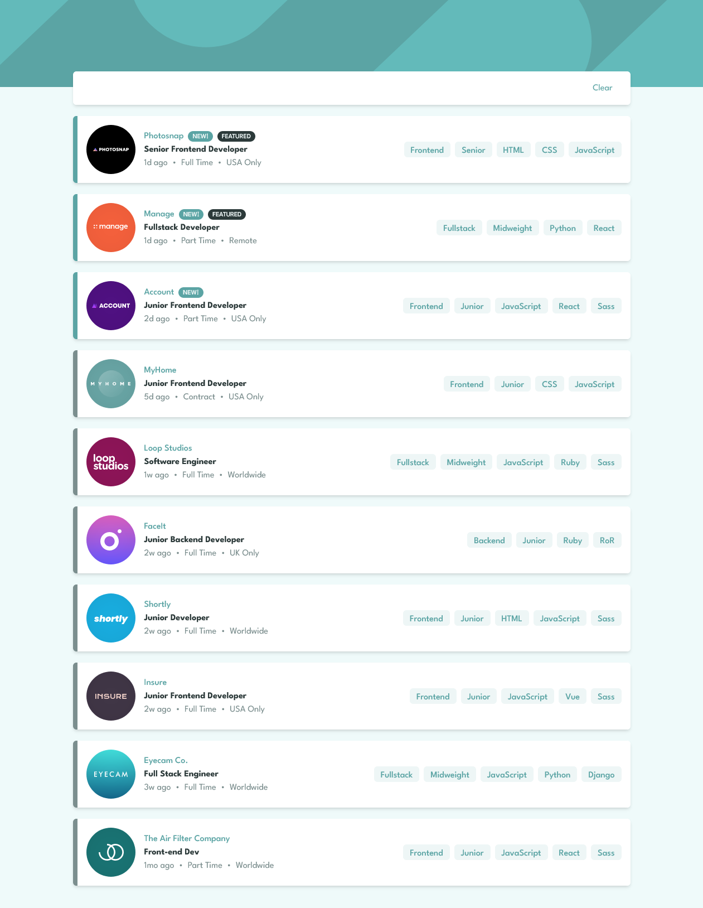

## Table of contents

- [Overview](#overview)
  - [Screenshot](#screenshot)
  - [Links](#links)
- [My process](#my-process)
  - [Built with](#built-with)
  - [What I learned](#what-i-learned)
  - [Useful resources](#useful-resources)
- [Author](#author)

## Overview
Super great example of filtering in JavaScript. Also, perfect responsive layout that is apearling to the user.

### Screenshot

### Links

- Repo URL: [[https://github.com/11kyle/job-listings-filter](https://github.com/11kyle/job-listings-filter)]
- Live Site URL: [[https://11kyle.github.io/job-listings-filter](https://11kyle.github.io/job-listings-filter)]

## My process

- Planning: My planning for this small project was minimal. I didn't document a project plan.
- Analysis: I selected which languages, frameworks and foundations to use. They are TailwindCSS, Create React App, GitHub Pages. I've been focusing on learning TailwindCSS and that's why is chose it over others like Bootstrap.
- Development: Used VS Code as my IDE. I have experience with MacOS and Windows but chose Windows for this project.
- Testing: Included opening the project in multiple browers and different screen sizes. Also, tested on my iPhone with Safari and Google Chrome by hosting my solution on Github Pages.

### Built with

- Semantic HTML5 markup
- CSS custom properties
- Flexbox
- Mobile-first workflow
- [React](https://reactjs.org/) - JS library
- [Create React App](https://create-react-app.dev/) - React framework
- [Tailwind](https://tailwindcss.com/) - For styles

### What I learned

I learned how to loading images in react from a json file.
The images need to be place inside the public directory but can also be within a sub directory.

The syntax for the json file is:

"logo": "./images/photosnap.svg",

You don't need to change directory out of the folder that the json is located.

### Useful resources

- [Stack Overflow](https://stackoverflow.com/) - Possible the best overall place to get help from the community. You can find a solution to every problem you face and if not, post your own.
- [MDN Web Docs](https://developer.mozilla.org/en-US/) - MDN Web Docs are great for reminding you everything you forget. I often use it to look up attributes for html tags and JavaScript methods.
- [TailwindCSS](https://tailwindcss.com/) - This is the documentation for TailwindCSS. It's always open when I use it as my CSS framework.
- [Deploying a React App to GitHub Pages](https://github.com/gitname/react-gh-pages) - This is the documentation on how to deploy a React App to GitHub Pages.

## Author

- Github - [Kyle](https://github.com/11kyle)
- Frontend Mentor - [@11kyle](https://www.frontendmentor.io/profile/11kyle)
- LinkedIn - [Kyle](https://www.linkedin.com/in/kylejohnsondeveloper/)
